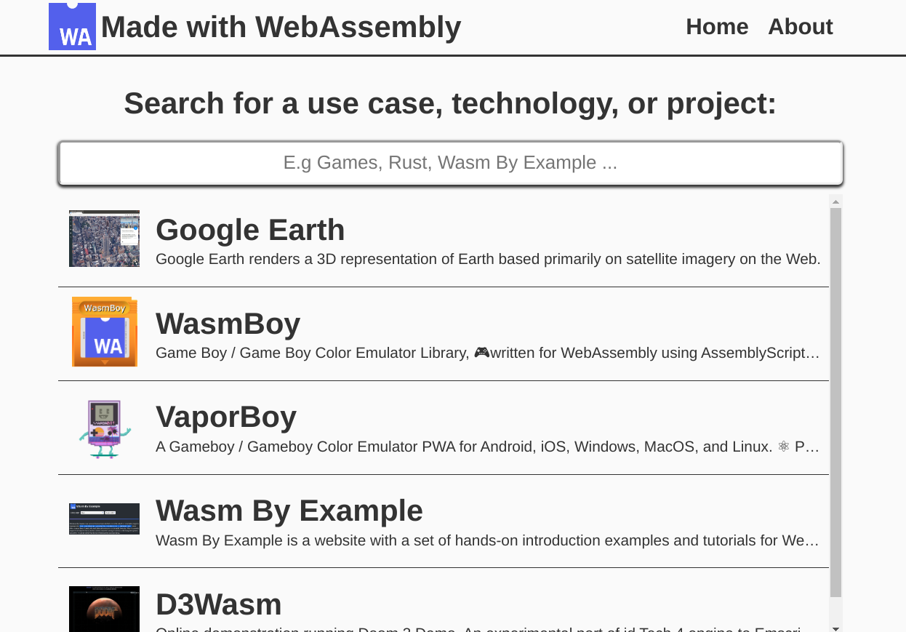

# Made with WebAssembly

 [](https://opensource.org/licenses/MIT)

Made with WebAssembly is a [website](https://madewithwebassembly.com/) A showcase of awesome production applications, side projects, and use cases made with WebAssembly ( Wasm )



A repo full of awesome side projects, production applications, and use cases made with webassembly

## Motivation

After several Twitter threads ([1](https://twitter.com/torch2424/status/1194557590765596673), [2](https://twitter.com/JamesLMilner/status/1151824280914731008), ...) on highlighting use cases, projects, and companies in production using WebAssembly. Myself and a few other Wasm communitty members thought it'd be a great idea to have a dedicated place to find projects using WebAssembly, and highlight what WebAssembly can be used for! We were hoping it could be easy to comb through, and provide additional context on why/how individual project are using Wasm.

## Contributing

### Showcase Projects

### App Shell

### Getting Started with Your First PR

#### One-time Setup

1. [Create a GitHub account](https://help.github.com/articles/signing-up-for-a-new-github-account/) if you don't already have one.
2. [Install and set up Git](https://help.github.com/articles/set-up-git/).
3. Install the latest LTS version of [Node.js](https://nodejs.org/) (which includes npm). An easy way to do so is with `nvm`. (Mac and Linux: [here](https://github.com/creationix/nvm), Windows: [here](https://github.com/coreybutler/nvm-windows))

```shell
nvm install --lts
```

4. Create your own fork of the [wasm-by-example repository](https://github.com/torch2424/wasm-by-example) by clicking "Fork" in the Web UI. During local development, this will be referred to by `git` as `origin`.

5. Download your fork to a local repository.

```shell
git clone git@github.com:<your username>/wasm-by-example.git
```

6. Add an alias called `upstream` to refer to the main `torch2424/wasm-by-example` repository. Go to the root directory of the
   newly created local repository directory and run:

```shell
git remote add upstream git@github.com:torch2424/wasm-by-example.git
```

7. Fetch data from the `upstream` remote:

```shell
git fetch upstream master
```

8. Set up your local `master` branch to track `upstream/master` instead of `origin/master` (which will rapidly become
   outdated).

```shell
git branch -u upstream/master master
```

#### Branch (do this each time you want a new branch)

Create and go to the branch:

```shell
git checkout -b <branch name> master
```

#### Building & Running the project

1. Make sure you have the latest packages (after you pull): `npm install` 2. To build the project, run: `npm run build` 3. To serve, and build on changes for the project, run: `npm run dev`

## Privacy

Google Analytics is used on Made with WebAssembly, and is only used to record [Basic visit data](https://support.google.com/analytics/answer/6004245?ref_topic=2919631), as the script is only loaded.

## License

This work is copyright Aaron Turner and licensed under a [MIT License](https://oss.ninja/mit?organization=Aaron%20Turner).

https://stackoverflow.com/questions/42952149/how-to-add-metadata-in-github-flavoured-markdown

https://stackoverflow.com/questions/44215896/markdown-metadata-format
